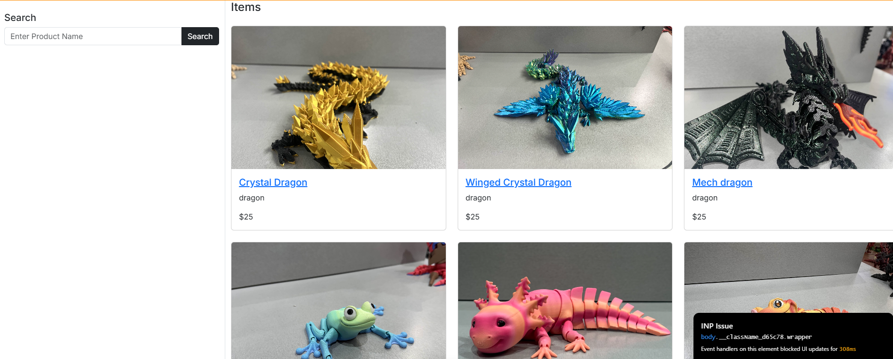
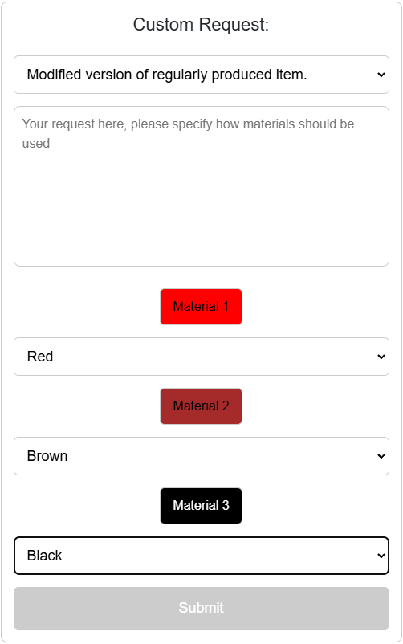

3d-Wizards was my first time doing a group coding project. The implementation is that it took and order from the store or a custom to the cart then once checked out of the cart it would be added to a postgres database. This site was added to vercel and still work as of 12/19 my part of the project was the custom order page and the design. 



The store has a working search bar and each of the items blue link takes to a second page a different member made.



The custom order has three parameter being a requestr type, decspirtion and a material. there must be a request type, decsprition and atleast one material selected in order to be added to the database. 

The requestr type, decspirtion were made by another person I added on the code made the material and updated the sumbit button

```cpp

{/* Material Buttons with Color Selectors */}
<div style={styles.materialButtons}>
  {materialKeys.map((material) => (
    <div key={material}>
      <button
        type="button"
        style={{
          ...styles.materialButton,
          backgroundColor: materialColors[material] || '#f5f5f5',
          color: materialColors[material] === 'black' ? 'white' : 'black',
        }}
        onClick={() => setSelectedMaterial(material)}
      >
        {material}
      </button>
      <select
        style={styles.dropdown}
        value={materialColors[material]}
        onChange={(e) => handleColorChange(material, e.target.value)}
      >
        <option value="">Select Color</option>
        {colors.map((color) => (
          <option key={color} value={color}>
            {color.charAt(0).toUpperCase() + color.slice(1)}
          </option>
        ))}
      </select>
    </div>
  ))}
</div>

```
Color changing submit button using css

```cpp

{/* CSS */}
const styles = {
  submitButton: {
    width: '100%',
    padding: '12px',
    fontSize: '18px',
    borderRadius: '6px',
    border: '1px solid #ccc',
    backgroundColor: '#4CAF50',
    color: 'white',
    cursor: 'pointer',
  },
  disabledButton: {
    backgroundColor: '#ccc',
    cursor: 'not-allowed',
  },
};

{/* Submit Button */}
<button
  type="submit"
  style={{
    ...styles.submitButton,
    ...(isFormValid ? {} : styles.disabledButton),
  }}
  disabled={!isFormValid}
>
  Submit
</button>

```
website link
https://3-d-wizards-inc-two.vercel.app/

Source: <a href="https://github.com/theVacay/vacay">theVacay/vacay</a>
