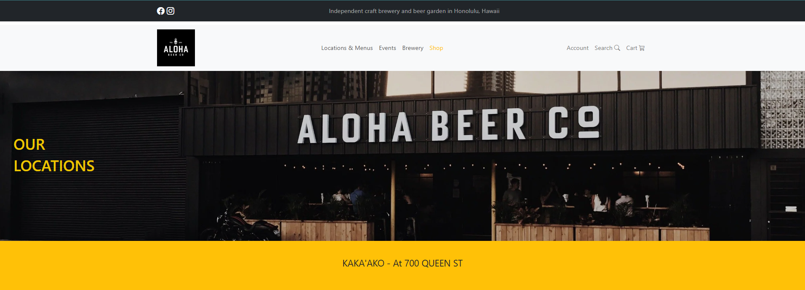

The test was to see if we could format and create empty links for each of the text options using the structure where all components are pulled from the components folder to the main folder.

``` cpp

<div>
  <TopMenu />
  <SecondMenu />
  <CenterImage />
  <Footer />
</div>

```

Source: <a href="https://github.com/john-a-flinn/Aloha-Beer-Nextjs">Aloha-Beer-Nextjs</a>