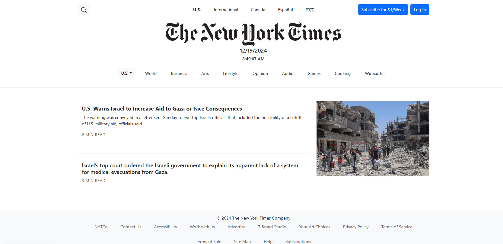

---

A simple webpage using Next.js, inspired by the New York Times website. The goal was to test and explore Next.js capabilities.

Each of the articles is displayed as its own card segment with working links.

```cpp

<Card.Body>
  <a
    href="https://www.nytimes.com/2024/10/15/world/middleeast/us-israel-military-aid-gaza-improvements.html" 
    target="_blank"
    rel="noopener noreferrer"
    style={{ textDecoration: 'none', color: 'inherit' }}
  >
    <Card.Title className="fw-bold">
      U.S. Warns Israel to Increase Aid to Gaza or Face Consequences
    </Card.Title>
    <Card.Text>
      The warning was conveyed in a letter sent Sunday to two top Israeli officials that included 
      the possibility of a cutoff of U.S. military aid, officials said.
    </Card.Text>
    <p className="text-muted">6 MIN READ</p>
  </a>
</Card.Body>

```

---

Function to get a working date and time for the header.

```cpp

const LogoSection = () => {
  const [dateTime, setDateTime] = useState(new Date());

  useEffect(() => {
    const timer = setInterval(() => setDateTime(new Date()), 1000);
    return () => clearInterval(timer);
  }, []);
  
  return (
    <div>
      {dateTime.toLocaleString()}
    </div>
  );
};

```
---

A single dropdown menu with only one row, as Next.js does not support multiple rows.

```cpp

const DropdownMenu = () => (
  <DropdownButton id="dropdown-basic-button" title="U.S." variant="light">
    {['Politics', 'New York', 'California', 'Education', 'Health'].map((item) => (
      <Dropdown.Item key={item}>{item}</Dropdown.Item>
    ))}
  </DropdownButton>
);

```

Source: <a href="https://github.com/john-a-flinn/my-nextjs-application">my-nextjs-application</a>